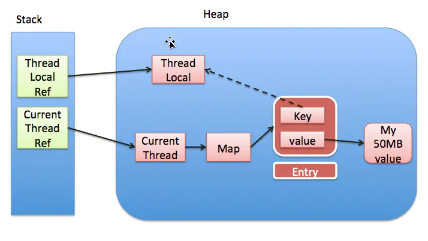

### ThreadLocal是什么
ThreadLocal是一个关于创建线程局部变量的类。

通常情况下，我们创建的变量是可以被任何一个线程访问并修改的。而使用ThreadLocal创建的变量只能被当前线程访问，其他线程则无法访问和修改。

### 用法简介
```java
//创建
ThreadLocal<String> mStringThreadLocal = new ThreadLocal<>();
//设置当前线程的线程局部变量的值。
mStringThreadLocal.set("droidyue.com");
//该方法返回当前线程所对应的线程局部变量。 
mStringThreadLocal.get();
//将当前线程局部变量的值删除，目的是为了减少内存的占用
mStringThreadLocal.remove();
```


### 内存泄漏问题
每个thread中都存在一个map, map的类型是ThreadLocal.ThreadLocalMap. Map中的key为一个threadlocal实例. 这个Map的确使用了弱引用,不过弱引用只是针对key. 每个key都弱引用指向threadlocal. **当把threadlocal实例置为null以后,没有任何强引用指向threadlocal实例,所以threadlocal将会被gc回收. 但是,我们的value却不能回收,因为存在一条从current thread连接过来的强引用. 只有当前thread结束以后, current thread就不会存在栈中,强引用断开, Current Thread, Map, value将全部被GC回收。所以得出一个结论就是只要这个线程对象被gc回收，就不会出现内存泄露，但在threadLocal设为null和线程结束这段时间不会被回收的，就发生了我们认为的内存泄露**其实这是一个对概念理解的不一致，也没什么好争论的。最要命的是线程对象不被回收的情况，这就发生了真正意义上的内存泄露。比如使用线程池的时候，线程结束是不会销毁的，会再次使用的就可能出现内存泄露 。（在web应用中，每次http请求都是一个线程，tomcat容器配置使用线程池时会出现内存泄漏问题）



ThreadLocal只是操作Thread中的ThreadLocalMap，每个Thread都有一个map，ThreadLocalMap是线程内部属性，ThreadLocalMap生命周期是和Thread一样的，不依赖于ThreadMap。ThreadLocal通过Entry保存在map中，key为Thread的弱引用（GC时会自动回收），value为存入的变量副本，一个线程不管有多少个ThreadLocal，都是通过一个ThreadLocalMap来存放局部变量的，可以再源码中看到，set值时先获取map对象，如果不存在则创建，threadLocalMap初始大小为16，当容量超过2/3时会自动扩容


### 建议
1.使用ThreadLocal，建议用static修饰 static ThreadLocal<HttpHeader> headerLocal = new ThreadLocal();
2.使用完ThreadLocal后，执行remove操作，避免出现内存溢出情况