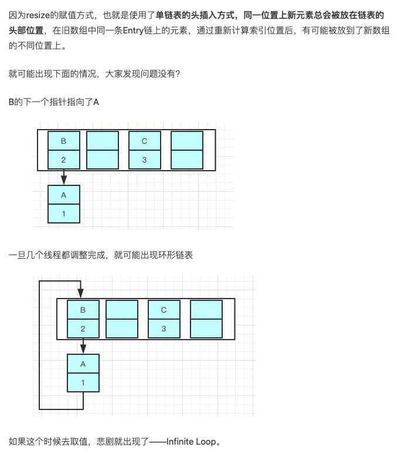

### 1.7 和 1.8 区别
### 扩容机制
### 线程不安全的原因
### 为什么大小为2的幂次
主要是为了位运算，位运算的效率高，之所以选择16，是为了服务将Key映射到index的算法
```java
static int indexFor(int h, int length) {
        return h & (length-1);
}
```
15的的二进制是1111，那10111011000010110100 &1111 十进制就是4
之所以**用位与运算效果与取模一样**，性能也提高了不少！

### 那为啥用16不用别的呢？
因为在使用是2的幂的数字的时候，Length-1的值是所有二进制位全为1，这种情况下，index的结果等同于HashCode后几位的值。

只要输入的HashCode本身分布均匀，Hash算法的结果就是均匀的。

这是为了实现均匀分布。

16 我觉得就是一个经验值，定义16没有很特别的原因，只要是2次幂，其实用 8 和 32 都差不多。用16只是因为作者认为16这个初始容量是能符合常用而已。


### 为什么1.7采用头插 1.8 采用尾插

使用头插会改变链表的上的顺序，但是如果使用尾插，在扩容时会保持链表元素原本的顺序，就不会出现链表成环的问题了,就是说原本是A->B，在扩容后那个链表还是A->B


***Java7在多线程操作HashMap时可能引起死循环，原因是扩容转移后前后链表顺序倒置，在转移过程中修改了原来链表中节点的引用关系。***

***Java8在同样的前提下并不会引起死循环，原因是扩容转移后前后链表顺序不变，保持之前节点的引用关系***


### 为啥我们重写equals方法的时候需要重写hashCode方法呢
重写equals方法我们是继承了object的equals方法，那里的 equals是比较两个对象的内存地址，显然我们new了2个对象内存地址肯定不一样

- 对于值对象，==比较的是两个对象的值
- 对于引用对象，比较的是两个对象的地址

我们去get的时候，他就是根据key去hash然后计算出index，找到了2，那我怎么找到具体的”帅丙“还是”丙帅“呢？

equals！是的，所以如果我们对equals方法进行了重写，建议一定要对hashCode方法重写，***以保证相同的对象返回相同的hash值，不同的对象返回不同的hash值。***

不然一个链表的对象，你哪里知道你要找的是哪个，到时候发现hashCode都一样，这不是完犊子嘛

那什么情况下我要重写呢
例如用到map的时候，map是根据key的hashCode和key.equals是否都相等判断是否存在重复的entry的。所以如果我们从map中put进两个值(key都为new User(1))，此时我们只重写了equals，而没有重写hashCode，得到的结果(size = 2)和我们期望的结果(size = 1)将不一样


### 为什么加载因子 是 0.75
加载因子是扩容的参考标准（threshold = capacity*loadfactor）默认数组初始大小为16，在加载因子为0.75（默认值）时，在数组长度（size）达到12就扩容，反之，如果把加载因子放大，到1，那么 threshold 就变成16，意味着，在数组长度达到16才会扩容，这时候也许已经产生很多哈希冲突了，导致某些链表过长，影响查询效率  

***加载因子过高，虽然提高了空间的利用率，但增加了查询时间的成本；加载因子过低，虽然减少查询时间的成本，但是空间利用率又很低了。所以0.75是一个折中的选择。***

###  链表长度为8转为红黑树的原因
官方根据泊松分布实验发现，假设hashmap长度,链表中存放8个节点的概率仅为0.00000006，而链表中存放1~7节点的概率为：

0: 0.60653066

1: 0.30326533

2: 0.07581633

3: 0.01263606

4: 0.00157952

5: 0.00015795

6: 0.00001316

7: 0.00000094
<<<<<<< HEAD
从以上可知，实际上***一个链表被放满8个节点的概率非常小***，实际上链表转红黑树是非常耗性能的，而链表在8个节点以内的平均查询时间复杂度与黑红树相差无几，超过8个节点，黑红树的查询复杂度会好一些。所以，当链表的节点大于等于8个的时候，转为红黑树的性价比比较合适
=======
从以上可知，实际上***一个链表被放满8个节点的概率非常小***，实际上链表转红黑树是非常耗性能的，而链表在8个节点以内的平均查询时间复杂度与黑红树相差无几，超过8个节点，黑红树的查询复杂度会好一些。所以，当链表的节点大于等于8个的时候，转为红黑树的性价比比较合适
>>>>>>> 40a242af0232139bd17053e23d4b9a941d0fe333
