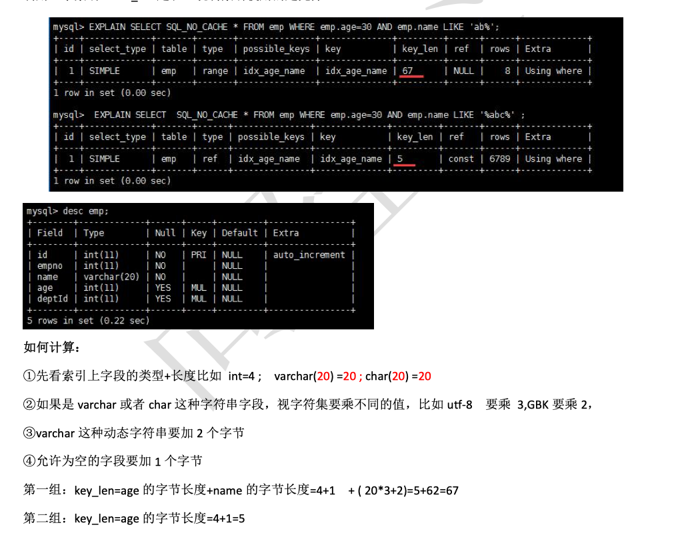
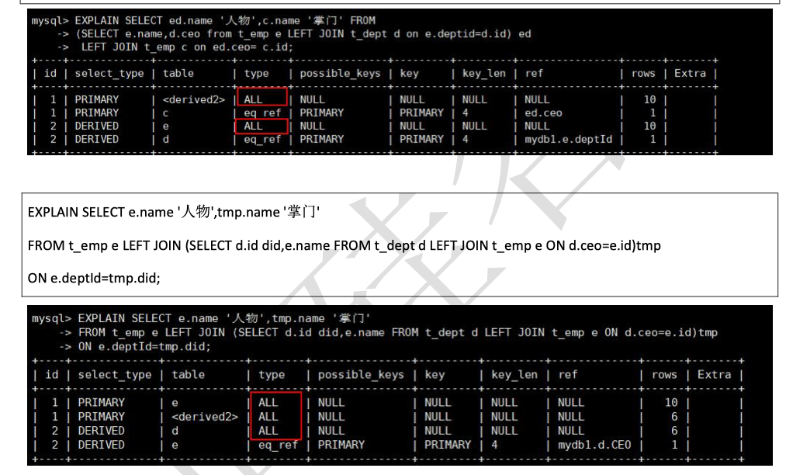

### 1. 聚簇索引 和 非 聚簇索引

- 聚簇索引：将数据存储与索引放到了一块，找到索引也就找到了数据

- 非聚簇索引：将数据存储于索引分开结构，索引结构的叶子节点指向了数据的对应行

    因此一个表仅有一个聚簇索引，一般是主键


### 2. 回表

如果是通过非主键索引进行查询，select所要获取的字段不能通过非主键索引获取到，需要通过非主键索引获取到的主键，从聚集索引再次查询一遍，获取到所要查询的记录，这个查询的过程就是回表


### 3. 索引的结构

B+树 和 hash   Innodb一般使用B+树


### 4. 索引分类

普通索引：仅加速查询

唯一索引：加速查询 + 列值唯一（可以有null）

主键索引：加速查询 + 列值唯一（不可以有null）+ 表中只有一个组合索引：多列值组成一个索引，专门用于组合搜

、索，其效率大于索引合并

全文索引：对文本的内容进行分词，进行搜索 目前只有MyISAM引擎支持 

索引合并，使用多个单列索引组合搜索

覆盖索引，select的数据列只用从索引中就能够取得，不必读取数据行，换句话说查询列要被所建的索引覆盖


### 5. Explain 执行计划 指标

#### 1. type  

 查询的类型 重要的指标

***system > const > eq_ref > ref >  range > index >all***

一般来说，得保证查询至少达到 range 级别，最好能达到 ref。记住这几种就好了

- System 只有一行记录（等于系统表）

- Const 表示通过索引一次就找到了

- eq_ref  唯一性索引扫描，对于每个索引键，表中只有一条记录与之匹配。常见于主键或唯一索引扫描

    ***此类型通常出现在多表的 join 查询, 表示对于前表的每一个结果, 都只能匹配到后表的一行结果. 并且查询的比较操作通常是 =, 查询效率较高***

    ```mysql
    explain select   *  from  t1  inner join  t2 on t1.id=t2.id
    ```

    

- ref  非唯一性索引扫描，返回匹配某个单独值的所有行

    ***此类型通常出现在多表的 join 查询, 针对于非唯一或非主键索引, 或者是使用了 最左前缀 规则索引的查询.***

    ```mysql
    create index index_content on t2(content)
    explain select   *  from  t1  inner join  t2 on t1.content=t2.content
    ```

- range 只检索给定范围的行,使用一个索引来选择行

    一般就是在你的 where 语句中出现 了 between、<、>、in 等的查询这种范围扫描索引扫描比全表扫描要好，因为它只需要开始于索引的某一点，而 结束语另一点，不用扫描全部索引

    ```mysql
    explain select   *  from  t1  where  id<10
    ```

    

- Index  出现index是sql使用了索引但是没用通过索引进行过滤，一般是使用了覆盖索引或者是利用索引进行了排序分组。

     index 类型通常出现在:*** 所要查询的数据直接在索引树中就可以获取到, 而不需要扫描数据. 当是这种情况时, Extra 字段 会显示 Using index***

    ```mysql
    explain select   *  from  t1    // all 全表扫描
    explain select   id  from  t1  //using index  直接从索引获取数据
    ```

    

- all  将遍历全表以找到匹配的行


#### 2.  key 
实际使用的索引。如果为NULL，则没有使用索引。

#### 3. key_len 
表示索引中使用的字节数，可通过该列计算查询中使用的索引的长度。 key_len 字段能够帮你检查是否充分的 利用上了索引。 ken_len 越长，说明索引使用的越充分



#### 4. ref 

显示索引的哪一列被使用了，如果可能的话，是一个常数。哪些列或常量被用于查找索引列上的值。

#### 5. Rows 

显示 MySQL 认为它执行查询时必须检查的行数。越少越好

#### 6 . Extra 
求他额外的重要信息

##### 6.1 Using filesort  
文件排序

说明 mysql 会对数据使用一个外部的索引排序，而不是按照表内的索引顺序进行读取。MySQL 中无法利用索引 完成的排序操作称为“文件排序”

```mysql
//emp   有符合索引 age_dept_name
explain select   id  from  emp WHERE deptId=100  order by name limit 10  //using filesort
explain select   id  from  emp WHERE age=100  order by deptId limit 10   //using index

```

##### 6.2 using temporary 

使了用临时表保存中间结果,MySQL 在对查询结果排序时使用临时表。常见于排序 order by 和分组查询 group by

```mysql
create index index_deptId on emp(deptId)
explain select   id  from  emp WHERE deptId=100  group by emp.name limit 10 //using temporary  用到了index_deptId
explain select   id  from  emp WHERE age=100  group by deptId limit 10 //using index 用到了索引age_dept_name


```


##### 6.3. Using index 

Using index 代表表示相应的 select 操作中使用了覆盖索引(Covering Index)，避免访问了表的数据行，效率不错！也就是***查询列被覆盖索引覆盖***

如果同时出现 using where，表明索引被用来执行索引键值的查找;如果没有同时出现 using where，表明索引只是 用来读取数据而非利用索引执行查找，

##### 6.4. using where 

表明使用了where过滤。


### 6.   单表索引的常见的技巧

- 全职匹配我最爱指的是，查询的字段按照顺序在索引中都可以匹配到！过滤条件要使用索引必须按照索引建立时的顺序，依次满足，一旦跳过某个字段，索引后面的字段都无法被使用, 下面的情况索引失效

    ```mysql
    CREATE INDEX idx_age_deptid_name ON emp(age,deptid,NAME);
    SELECT  * FROM emp WHERE  deptid=4 AND emp.name = 'abcd'   // 由于没有age所以不会走索引
    ```

    SQL 中查询字段的顺序，跟使用索引中字段的顺序，没有关系。优化器会在不影响 SQL 执行结果的前提下，给 你自动地优化

- 不在索引列上做任何操作（计算、函数、(自动 or 手动)类型转换），会导致索引失效而转向全表扫描。等号左边无计算！

    ```mysql
    SELECT  * FROM emp WHERE LEFT(age,3)=30
    ```

- 字符串不加单引号，索引会失效

    ```mysql
    explain select sql_no_cache * from emp where name='30000';
    explain select sql_no_cache * from emp where name=30000;  这种情况会使索引失效
    ```

    

- 索引列上不要有范围查询

    ```mysql
    explain SELECT SQL_NO_CACHE * FROM emp WHERE emp.age=30 and deptid=5 AND emp.name = 'abcd';
    explain SELECT SQL_NO_CACHE * FROM emp WHERE emp.age=30 and deptid<=5 AND emp.name = 'abcd'; //deptid 后面的字段都不会使用索引，
    explain SELECT SQL_NO_CACHE * FROM emp WHERE emp.age=30 and deptid<=5 order by emp.name ; //deptid 后面的字段都不会使用索引，
    ```

    建议：将可能做范围查询的字段的索引顺序放在最后

- 尽量使用覆盖索引

    ```mysql
    explain SELECT SQL_NO_CACHE * FROM emp WHERE emp.age=30 and deptId=4 and name='XamgXt';//根据索引查询到数据后还需要回表查询
    explain SELECT SQL_NO_CACHE age,deptId,name FROM emp WHERE emp.age=30 and deptId=4 and name='XamgXt';//使用了覆盖索引
    ```

    

- 使用!=或者  <> 索引也会失效

    ```mysql
    explain
    SELECT  * FROM emp WHERE  age!=12  //当前表有索引 index_age_dept_name，但是不走索引
    ```

    

- like  前面不能出现 %

    ```mysql
    create index index_name  on emp(name)
    explain SELECT  * FROM emp WHERE  name  like '%xx%'  //不走索引
    explain SELECT  * FROM emp WHERE  name  like 'xx%'   //走索引
    ```

    

- 减少使用or 

    ```mysql
    explain  SELECT  * FROM emp WHERE  age   =12 or age=14  //不走索引
    explain  SELECT  * FROM emp WHERE  age   =12 union all SELECT  * FROM emp WHERE  age   =14 //走索引
    ```


- 区分度不大的情况下 索引也有可能会失效

  ```mysql
  explain  SELECT  * FROM emp WHERE  code like  '123456%'  // 表中的code 全是123456开头的 这种情况下 也是不会走索引的，看似可以走索引其实muysql优化器不会走
  
  
  ```

  

### 7.  多表join索引技巧

  **小结果集驱动大结果集**

- 在优化关联查询时，只有在被驱动表上建立索引才有效！

    **left join 时，左侧的为驱动表，右侧为被驱动表**

    **inner join  会自动帮你选择小结果集的表为驱动表**

```mysql
ALTER TABLE `book` ADD INDEX idx_card( `card`);
EXPLAIN SELECT * FROM class LEFT JOIN book ON class.card = book.card;
//加在 被驱动表上 索引有效
```

- 子查询尽量不要放在被驱动表，有可能使用不到索引；

- left join时，尽量让实体表作为被驱动表。

    


### 8.  order by groupby 索引技巧

  参考索引分析

 


### 9. 索引案例分析
建索引：

建索引：

create index idx_test03_c1234 on test03(c1,c2,c3,c4);
show index from test03;
问题：我们创建了复合索引idx_test03_c1234 ,根据以下SQL分析下索引使用情况？

1 . explain select * from test03 where c1=‘a1’;


答：使用了一个c1索引。


2. explain select * from test03 where c1=‘a1’ and c2=‘a2’;


答：使用了二个c1、c2索引。


3. explain select * from test03 where c1=‘a1’ and c2=‘a2’ and c3=‘a3’;


答：使用了三个c1、c2、c3索引。


4. explain select * from test03 where c1=‘a1’ and c2=‘a2’ and c3=‘a3’ and c4=‘a4’;

   

答：使用了四个c1、c2、c3、c4索引。


5. explain select * from test03 where c1=‘a1’ and c2=‘a2’ and c4=‘a4’ and c3=‘a3’;

   

答：使用了四个c1、c2、c3、c4索引。(c4和c3顺序颠倒，mysql内部sql优化器会自动识别排序)


6.explain select * from test03 where c1=‘a1’ and c2=‘a2’ and c3>‘a3’ and c4=‘a4’;


答：使用了三个c1、c2、c3索引。(c3范围匹配之后中断c4索引的使用)


7.explain select * from test03 where c1=‘a1’ and c2=‘a2’ and c4>‘a4’ and c3=‘a3’;


答：使用了四个c1、c2、c3、c4索引。(c4和c3顺序颠倒，mysql内部sql优化器会自动识别排序，c4为范围匹配但还是会用到索引)

8 .explain select * from test03 where c1=‘a1’ and c2=‘a2’ and c4=‘a4’ order by c3;


答：使用了二个c1、c2索引。(c3作用在排序而不是查找)

9.explain select * from test03 where c1=‘a1’ and c2=‘a2’ order by c3;


答：使用了二个c1、c2索引。(c3作用在排序而不是查找,也跟c4没啥关系)

10.explain select * from test03 where c1=‘a1’ and c2=‘a2’ order by c4;


答：使用了二个c1、c2索引。(出现了filesort，因为c3断开了)

11.explain select * from test03 where c1=‘a1’ and c5=‘a5’ order by c2,c3;


答： 只用c1一个字段索引，但是c2、c3用于排序,无filesort

12.explain select * from test03 where c1=‘a1’ and c5=‘a5’ order by c3,c2;


答：出现了filesort，我们建的索引是c1 c2 c3 c4，它没有按照顺序来，c3 c2 颠倒了

13.explain select * from test03 where c1=‘a1’ and c2=‘a2’ order by c2,c3;


答：使用了二个c1、c2索引。(查找和排序都是按索引)

14.explain select * from test03 where c1=‘a1’ and c2=‘a2’ and c5=‘a5’ order by c2,c3;


答：用c1、c2两个字段索引，但是c2、c3用于排序,无filesort

15.explain select * from test03 where c1=‘a1’ and c2=‘a2’ and c5=‘a5’ order by c3,c2;(与12题对比)

答：使用了二个c1、c2索引。(因为之前c2已经是一个常量，不影响后续排序，所以查找和排序都是按索引)

16.explain select * from test03 where c1=‘a1’ and c4=‘a4’ group by c2,c3;


答：只用c1一个索引。

17.explain select * from test03 where c1=‘a1’ and c4=‘a4’ group by c3,c2;


答：只用一个索引，会出现Using temporary; Using filesort 。(因为group by分组之前必排序，与order by排序和索引优化原则基本相同。此题中 group by c3,c2不是索引顺序，group by自己排，会有临时表产生)


参考文章 ： 	https://www.cxyzjd.com/article/qq_37132495/113133812