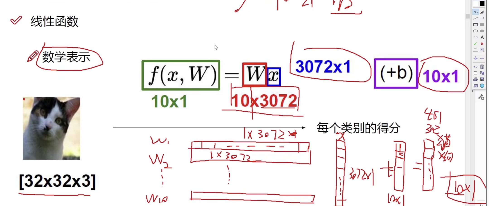
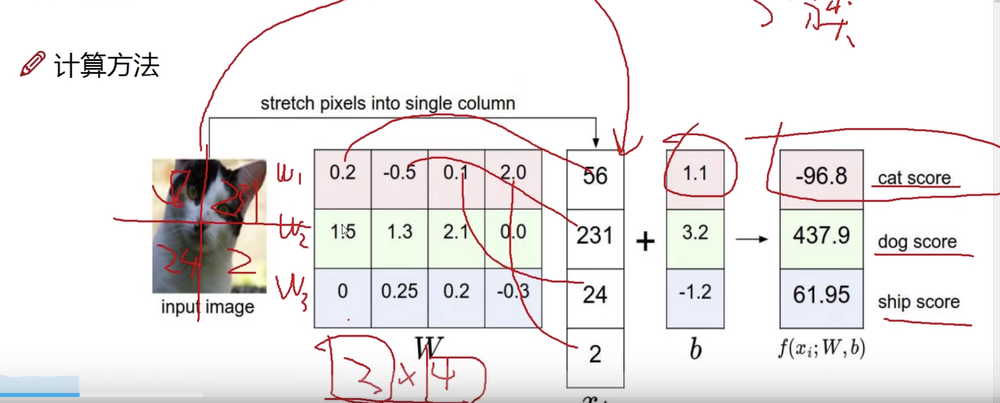
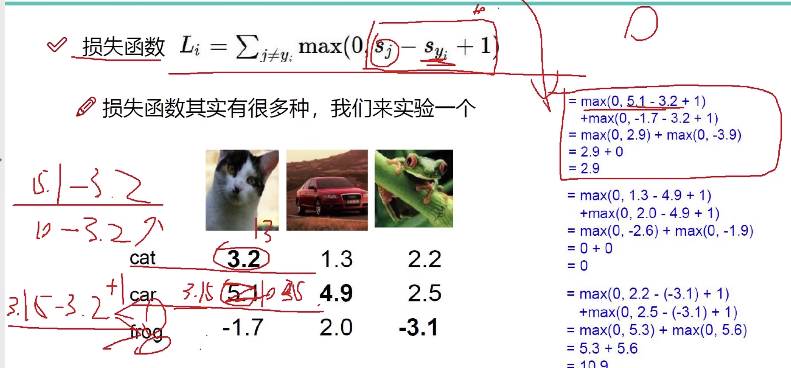
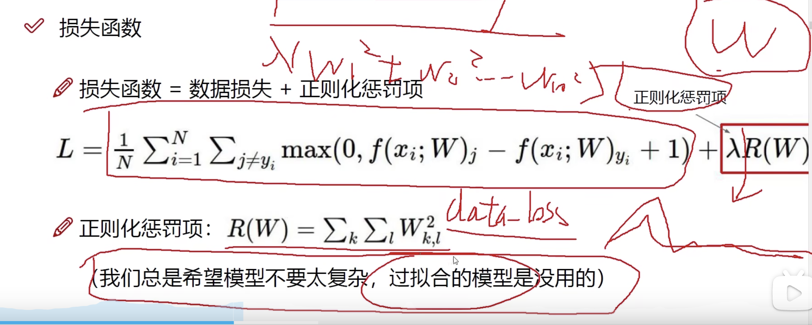
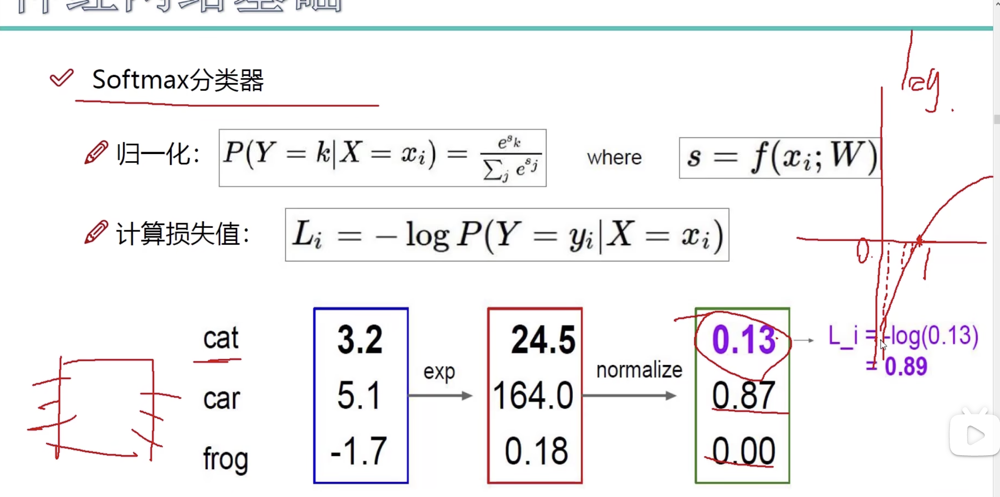
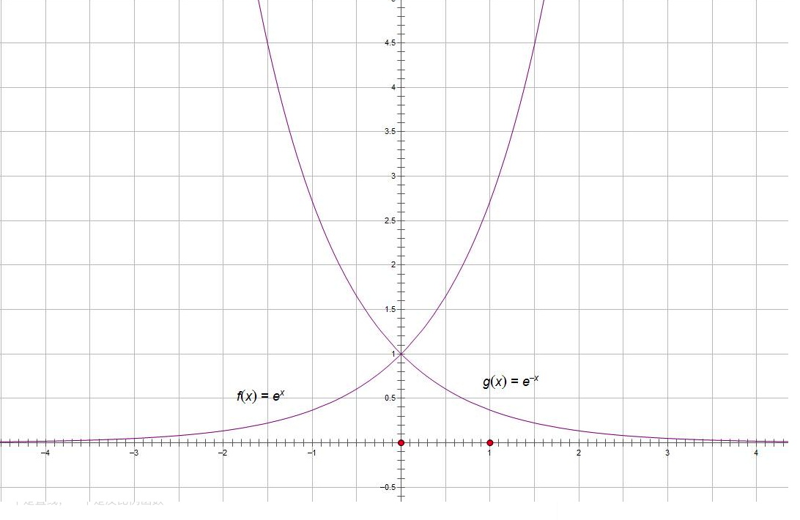
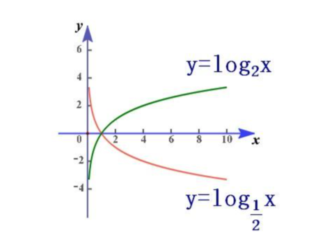

机器学习：


 ### 神经网络基础

- K 近邻算法
- CIFAR-10 数据库样例  32*32*3  = 长度32*宽度32*3rgb
  - 10类标签  5w训练数据  1w测试数据
  - 图像类别判断  d1(I1,I2) = ∑ |I1p-I2p|
  - k近邻不能用于分类，背景主导有问题，主体是重点关注部分==》忽略背景关注主体
  - 线性函数  f(x,w) =  Wx + b 

    每个类别的得分函数  f(x,W)  x表示像素点 W 表示权重，【由于每个像素点对主体识别的权重不一样】
     得分函数 f(x,w) =  Wx + b  (b微调参数，对应每个分类的微调参数，W是权重参数)
      比如 W1 是猫的权重  W1 = 1*(32*32*3) = 1*3072 每个像素点的权重  ，依次类推W2...W10 等10个分类的权重函数 ,W 越大标签当前像素点在这个分类的权重越大，正值表示 
       f(x,W1) = 猫的得分
       f(x,W2) = 狗的得分 

       

       

       ***神经网络主要做的事情是 找到合适的W 权重函数让 得分函数复合结果***

  - 损失函数     
    得出 明确当前指导模型的效果有多好、有多差


权重函数尽量

过拟合的模型，也就是只注重部分数据，不能全局关注，这种模型是不好的模型
损失函数 =   数据损失 +  正则化惩罚项目




正则化惩罚项目 = λR(W)  λ越大，不希望过拟合，越小 有一些过拟合没关系 





```
一个输入数据 猫的得分 汽车得分3.2 猫的得分5.1  青蛙的得分 -1.7
得分进行 e^x 计算，放大差异，e^x次幂函数 图像  ，可以看出 x值越大后面差异越大，x 负数时 越大概率趋向于0 
得到  24.5、164.0、0.18 
相加  188.68
然后每个 放大的值进行概率统计
得到概率值  
    24.5/188.68 = 0.13 
    164/188.68 = 0.87
    0.18/188.68 =0.00 
损失函数计算 概率值越小损失越大，概率越大损失越小 概率值在0-1之间
    L = -log概率值 = -log0.13 
```



