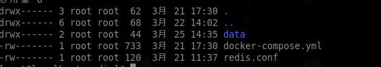

#### 目录结构




###  docker-compose 部署redis 

docker-compose.yml 文件

```yml
version: '3'
services:
  redis:
    image: redis:6.2.6
    container_name: redis
    restart: on-failure # 重启方式
    environment:
      - TZ=Asia/Shanghai # 设置时区
    logging:
      driver: json-file
      options:
        max-size: "100m"
        max-file: "5"
    ports:
    - "6379:6379"
    volumes:
        - /data/docker-compose/redis/data:/data
        - /data/docker-compose/redis/redis.conf:/usr/local/etc/redis/redis.conf
    sysctls: # 设置容器中的内核参数
      - net.core.somaxconn=1024
    command: /bin/sh -c "echo 'vm.overcommit_memory = 1' >> /etc/sysctl.conf && redis-server /usr/local/etc/redis/redis.conf"
    privileged: true      # 使用该参数，container内的root拥有真正的ro
```


redis.conf 配置
```conf
requirepass pMz^enwPCZHv$iTo
bind 0.0.0.0
appendonly yes
maxmemory 3GB
```