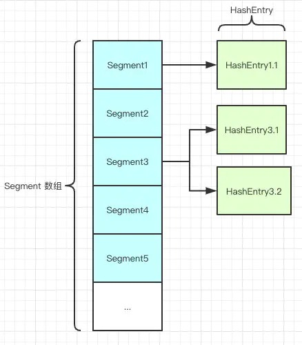

参考： https://juejin.cn/post/6844904023003250701


###  HashMap在多线程环境下存在线程安全问题，那你一般都是怎么处理这种情况的？

- 使用Collections.synchronizedMap(Map)创建线程安全的map集合；
- Hashtable
- ConcurrentHashMap

不过出于线程并发度的原因，我都会舍弃前两者使用最后的ConcurrentHashMap，他的性能和效率明显高于前两者。

### Collections.synchronizedMap是怎么实现线程安全的你有了解过么？
在SynchronizedMap内部维护了一个普通对象Map，还有排斥锁mutex，再操作map的时候，就会对方法上锁，


##  ConcurrentHashMap  的底层结构
1.7 的数据结构 



​		如图所示，是由 Segment 数组、HashEntry 组成，和 HashMap 一样，仍然是**数组加链表**。

```java
static final class Segment<K,V> extends ReentrantLock implements Serializable {
  private static final long serialVersionUID = 2249069246763182397L;    // 和 HashMap 中的 HashEntry 作用一样，真正存放数据的桶   
  transient volatile HashEntry<K,V>[] table;  
  transient int count;        // 记得快速失败（fail—fast）么？   
  transient int modCount;        // 大小  
  transient int threshold;        // 负载因子    
  final float loadFactor;
}

```

HashEntry  采用 volatile修饰

volatile的特性

- 保证了不同线程对这个变量进行操作时的可见性，即一个线程修改了某个变量的值，这新值对其他线程来说是立即可见的。（实现**可见性**）

- 禁止进行指令重排序。（实现**有序性**）

- volatile 只能保证对单次读/写的原子性。i++ 这种操作不能保证**原子性**。

    

##  ConcurrentHashMap并发度高的原因么？

原理上来说，ConcurrentHashMap 采用了分段锁技术，其中 Segment 继承于 ReentrantLock,不会像 HashTable 那样不管是 put 还是 get 操作都需要做同步处理，理论上 ConcurrentHashMap 支持 CurrencyLevel (Segment 数组数量)的线程并发,每当一个线程占用锁访问一个 Segment 时，不会影响到其他的 Segment

他先定位到Segment，然后再进行put操作，put 的源码是怎么做到线程安全的
```java


```
-  第一步的时候会尝试获取锁，如果获取失败肯定就有其他线程存在竞争，则利用 scanAndLockForPut() 自旋获取锁。
-  如果重试的次数达到了 MAX_SCAN_RETRIES 则改为阻塞锁获取，保证能获取成功。

get 的逻辑
只需要将 Key 通过 Hash 之后定位到具体的 Segment ，再通过一次 Hash 定位到具体的元素上。
由于 HashEntry 中的 value 属性是用 volatile 关键词修饰的，保证了内存可见性，所以每次获取时都是最新值。
ConcurrentHashMap 的 get 方法是非常高效的，因为整个过程都不需要加锁


## 1.8 concurrentHashMap  数据结构模型

其中抛弃了原有的 Segment 分段锁，而采用了 `CAS + synchronized` 来保证并发安全性

CAS 是乐观锁的一种实现方式，是一种轻量级锁，JUC 中很多工具类的实现就是基于 CAS 的

**线程在读取数据时不进行加锁，在准备写回数据时，比较原值是否修改，若未被其他线程修改则写回，若已被修改，则重新执行读取流程 **

CAS 会有ABA 问题，就是说来了一个线程把值改回了B，又来了一个线程把值又改回了A，对于这个时候判断的线程，就发现他的值还是A，所以他就不知道这个值到底有没有被人改过，其实很多场景如果只追求最后结果正确，这是没关系的，但是实际过程中还是需要记录修改过程的，比如资金修改什么的，你每次修改的都应该有记录，方便回溯。

> ABA 解决办法
>
> - 用版本号去保证
> - 如时间戳也可以

synchronized之前一直都是重量级的锁，但是后来java官方是对他进行过升级的，他现在采用的是锁升级的方式去做的

针对 synchronized 获取锁的方式，JVM 使用了锁升级的优化方式，

就是先使用**偏向锁**优先同一线程然后再次获取锁，如果失败，就升级为 **CAS 轻量级锁**，如果失败就会短暂**自旋**，防止线程被系统挂起。最后如果以上都失败就升级为**重量级锁**。

所以是一步步升级上去的，最初也是通过很多轻量级的方式锁定的。

### 1.8 concurrentHashMap   是如何存取的数据的 

